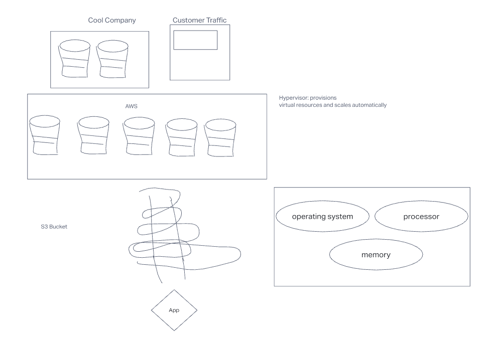

# cloud-server

## Author: Brandon Pitts
## Problem Domain
Deploy a simple Node.js server to EC2, using Elastic Beanstalk
## Phase 1
Create a new environment, using Elastic Beanstalk from the AWS Control Panel (GUI)
Manually deploy your application to this environment by uploading a .zip file
## Phase 2
Using the same server, create a new environment using Elastic Beanstalk from your terminal
Manually deploy your application to this environment by using eb deploy
## Dependencies
* Express
### Setup
* npm init -y
* create basic application foundation
* npm i express
### UML 

